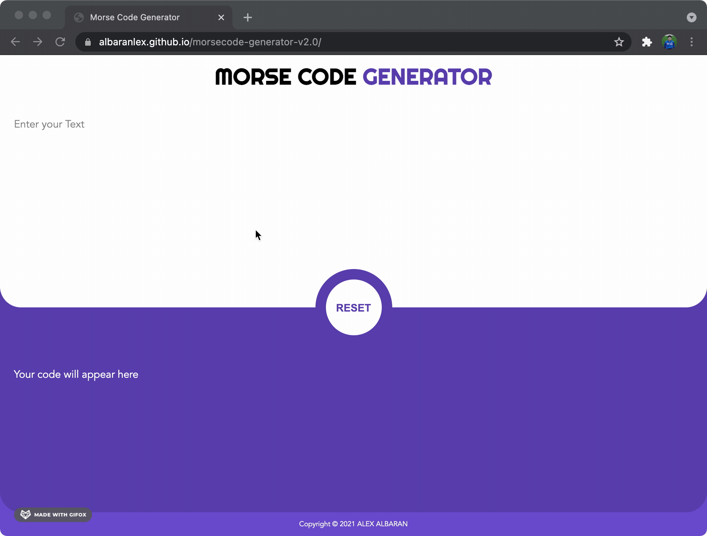

## Project Link

<https://albaranlex.github.io/morsecode-generator-v2.0/>

## Project Summary

- The project utilizes React JS, which includes, but not limited to, components, events and states. The website layout was done with SCSS.
- The layout is pure CSS. No vectors or SVGs were added. Shapes were made from scratch.
- The website is responsive, made possible with the use of `flexbox`.

## Available Scripts

In the project directory, you can run:

### `npm start`

Runs the app in the development mode.\
Open [http://localhost:3000](http://localhost:3000) to view it in the browser.

The page will reload if you make edits.\
You will also see any lint errors in the console.

## Node SASS

To install, you can run

### `npm i node-sass`

Installs scss to the project folder.\
